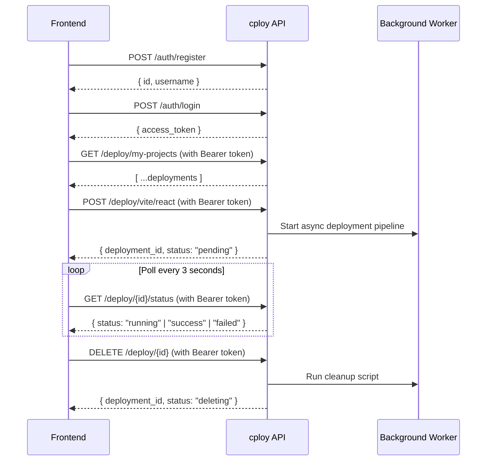
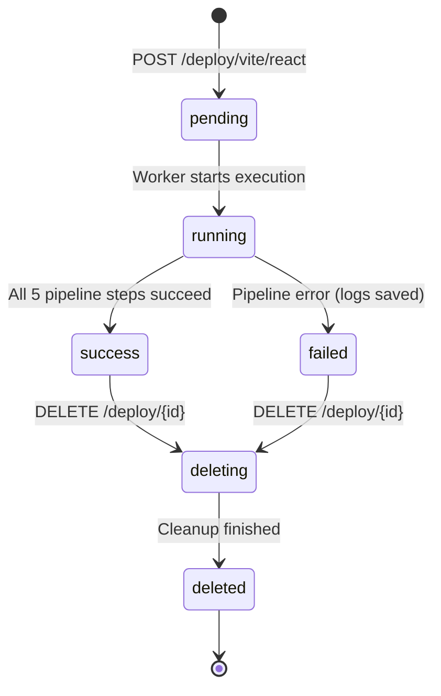

# cploy API Documentation

> **Base URL**: `http://<server-ip>:8000`  
> **Interactive Docs**: `GET /docs` (Swagger UI) · `GET /redoc` (ReDoc)

---

## Table of Contents

- [Overview](#overview)
- [CORS Configuration](#cors-configuration)
- [Authentication](#authentication)
  - [How Auth Works](#how-auth-works)
  - [POST /auth/register](#post-authregister)
  - [POST /auth/login](#post-authlogin)
- [Deploy](#deploy)
  - [How Deploy Works](#how-deploy-works)
  - [Automatic Port Assignment](#automatic-port-assignment)
  - [Monorepo & Subfolder Support](#monorepo--subfolder-support)
  - [Environment Variables](#environment-variables)
  - [Deployment Limit](#deployment-limit)
  - [GET /deploy/my-projects](#get-deploymy-projects)
  - [POST /deploy/vite/react](#post-deployvitereact)
  - [GET /deploy/{deployment_id}/status](#get-deploydeployment_idstatus)
  - [DELETE /deploy/{deployment_id}](#delete-deploydeployment_id)
- [Health Check](#health-check)
  - [GET /](#get-)
- [Data Models Reference](#data-models-reference)
- [Deployment Status Lifecycle](#deployment-status-lifecycle)
- [Error Reference](#error-reference)
- [Frontend Integration Guide](#frontend-integration-guide)
- [Quick Reference](#quick-reference--all-endpoints)

---

## Overview

cploy is a self-hosted deployment platform. The API lets you:

1. **Register** an account and **log in** to receive a JWT access token
2. **Deploy** a Vite / React app from any public Git repository with optional environment variables (runs asynchronously in the background)
3. **Poll** deployment status in real-time until the build and configuration complete
4. **List** all projects deployed by your account
5. **Delete** deployments cleanly (stops containers, cleans Docker images, removes Nginx virtual hosts, and purges files)

> [!IMPORTANT]
> Each user is limited to **2 active deployments** at a time. Deleting a deployment or having a failed one automatically frees up a slot.

All deploy endpoints are **protected** — they require a valid JWT in the `Authorization` header.



---

## CORS Configuration

The API allows cross-origin requests from:

| Origin | Purpose |
|--------|---------|
| `http://localhost:5173` | Vite dev server default |
| `https://dev-saurabh-k.xyz` | Production apex domain |
| `https://www.dev-saurabh-k.xyz` | Production www domain |
| `https://cploy.dev-saurabh-k.xyz` | cploy dashboard subdomain |

All HTTP methods (`GET`, `POST`, `DELETE`, `OPTIONS`), custom headers, and credentials are supported.

---

## Authentication

### How Auth Works

| Detail | Value |
|--------|-------|
| **Method** | JWT Bearer Token (OAuth2 Password Flow) |
| **Token Lifetime** | 60 minutes |
| **Algorithm** | HS256 |
| **Header Format** | `Authorization: Bearer <token>` |

---

### POST /auth/register

Create a new user account.

| Property | Value |
|----------|-------|
| **URL** | `/auth/register` |
| **Method** | `POST` |
| **Auth Required** | ❌ No |
| **Content-Type** | `application/json` |

#### Request Body

| Field | Type | Required | Description |
|-------|------|----------|-------------|
| `username` | `string` | ✅ | Unique username (max 50 characters) |
| `password` | `string` | ✅ | Plain-text password (hashed server-side with bcrypt) |

```json
{
  "username": "saurabh",
  "password": "mySecurePassword123"
}
```

#### Success Response — `201 Created`

```json
{
  "id": 1,
  "username": "saurabh"
}
```

#### Error Responses

| Status | Condition | Response Body |
|--------|-----------|---------------|
| `400 Bad Request` | Username already taken | `{"detail": "Username already taken"}` |
| `422 Unprocessable Entity` | Validation error (missing field) | Detailed field errors |

---

### POST /auth/login

Authenticate with credentials and obtain a JWT access token.

| Property | Value |
|----------|-------|
| **URL** | `/auth/login` |
| **Method** | `POST` |
| **Auth Required** | ❌ No |
| **Content-Type** | `application/x-www-form-urlencoded` |

> [!NOTE]
> This endpoint uses **form data** (`application/x-www-form-urlencoded`), conforming to OAuth2 specifications and enabling the Swagger UI `/docs` Authorize button to work directly.

#### Request Body (Form URL-Encoded)

```
username=saurabh&password=mySecurePassword123
```

#### Success Response — `200 OK`

```json
{
  "access_token": "eyJhbGciOiJIUzI1NiIsInR5cCI6IkpXVCJ9...",
  "token_type": "bearer"
}
```

#### Error Responses

| Status | Condition | Response Body |
|--------|-----------|---------------|
| `401 Unauthorized` | Invalid username or password | `{"detail": "Invalid username or password"}` |

---

## Deploy

### How Deploy Works

Deployments run **asynchronously** via background worker tasks:

1. `POST /deploy/vite/react` performs immediate validation, assigns a dedicated port, creates a DB entry, and responds with `202 Accepted` in `< 100ms`.
2. A background worker executes the multi-stage deployment pipeline:
   - **Step 1 (`git_setup`):** Clones the repository dynamically (auto-detects default branch `main`, `master`, etc.) and verifies `package.json`.
   - **Step 2 (`create_deployment`):** Injects the universal multi-stage Dockerfile and Nginx SPA routing assets.
   - **Step 3 (`create_compose`):** Generates `docker-compose.yml` and writes provided environment variables to `.env`.
   - **Step 4 (`docker_compose`):** Runs `docker compose up -d --build` with isolated networking.
   - **Step 5 (`nginx`):** Configures host Nginx reverse proxy with live reloading for `<image_name>.dev-saurabh-k.xyz`.
3. If any step fails, status transitions to `failed` and detailed error logs are attached.

### Automatic Port Assignment

- Ports are **automatically allocated** by the system in the range **`10000` to `40000`**.
- Clients do not specify port numbers in requests.
- When a deployment is deleted or fails, its port is instantly freed and recycled for future deployments.

### Monorepo & Subfolder Support

- If `package.json` is not at the repository root, the deploy worker automatically searches immediate subdirectories (e.g. `client/`, `frontend/`, `web/`, `app/`, `ui/`).
- Found subfolder contents are promoted to the deployment root before building.

### Environment Variables

- You can supply custom environment variables via the `environment_variables` dictionary.
- Key names must follow standard format `[A-Za-z_][A-Za-z0-9_]*`.
- Values cannot contain newlines or null bytes.
- Maximum 100 environment variables per deployment.

### Deployment Limit

> [!IMPORTANT]
> Each user can have a maximum of **2 active deployments** (`pending`, `running`, `success`, `deleting`). `failed` and `deleted` deployments do not count against this quota.

---

### GET /deploy/my-projects

List all deployments created by the authenticated user, ordered from newest to oldest.

| Property | Value |
|----------|-------|
| **URL** | `/deploy/my-projects` |
| **Method** | `GET` |
| **Auth Required** | ✅ Yes — `Authorization: Bearer <token>` |

#### Response — `200 OK`

```json
[
  {
    "id": 2,
    "image_name": "portfolio",
    "port": "10001",
    "repo_url": "https://github.com/user/portfolio.git",
    "status": "success",
    "error_message": null,
    "domain": "portfolio.dev-saurabh-k.xyz"
  },
  {
    "id": 1,
    "image_name": "ecommerce",
    "port": "10000",
    "repo_url": "https://github.com/user/ecommerce.git",
    "status": "running",
    "error_message": null,
    "domain": null
  }
]
```

---

### POST /deploy/vite/react

Queue a new Vite + React project deployment.

| Property | Value |
|----------|-------|
| **URL** | `/deploy/vite/react` |
| **Method** | `POST` |
| **Auth Required** | ✅ Yes — `Authorization: Bearer <token>` |
| **Content-Type** | `application/json` |

#### Request Body

| Field | Type | Required | Description |
|-------|------|----------|-------------|
| `image_name` | `string` | ✅ | Unique app name (`1-63` chars, lowercase alphanumeric with internal hyphens, starts with letter). Becomes subdomain `<image_name>.dev-saurabh-k.xyz`. |
| `repo_url` | `string` | ✅ | Public Git repository URL (e.g. `https://github.com/owner/repo`). |
| `environment_variables` | `object` | ❌ | Key-value pairs of build/runtime environment variables (default: `{}`). |

```json
{
  "image_name": "my-store",
  "repo_url": "https://github.com/Dev-Saurabh-K/e-commerce-ag",
  "environment_variables": {
    "VITE_API_URL": "https://api.example.com",
    "VITE_ENV": "production"
  }
}
```

#### Success Response — `202 Accepted`

```json
{
  "deployment_id": 3,
  "status": "pending",
  "message": "Deployment started. Poll /deploy/{id}/status for updates."
}
```

#### Error Responses

| Status | Condition | Response Body |
|--------|-----------|---------------|
| `401 Unauthorized` | Missing or expired JWT token | `{"detail": "Invalid or expired token"}` |
| `403 Forbidden` | User quota exceeded (2 active apps) | `{"detail": "Deployment limit reached. Maximum 2 active deployments per user."}` |
| `409 Conflict` | App name already taken by another active deployment | `{"detail": "An active deployment already uses this app name."}` |
| `422 Unprocessable Entity` | Invalid app name format or invalid env var keys | Detailed validation error |
| `503 Service Unavailable` | Port pool exhausted | `{"detail": "No available ports. Please try again later."}` |

---

### GET /deploy/{deployment_id}/status

Poll status and details of a single deployment.

| Property | Value |
|----------|-------|
| **URL** | `/deploy/{deployment_id}/status` |
| **Method** | `GET` |
| **Auth Required** | ✅ Yes — `Authorization: Bearer <token>` |

#### Response — `200 OK`

```json
{
  "id": 3,
  "image_name": "my-store",
  "port": "10002",
  "repo_url": "https://github.com/Dev-Saurabh-K/e-commerce-ag",
  "status": "success",
  "error_message": null,
  "domain": "my-store.dev-saurabh-k.xyz"
}
```

#### Error Responses

| Status | Condition | Response Body |
|--------|-----------|---------------|
| `401 Unauthorized` | Invalid/missing authentication token | `{"detail": "Invalid or expired token"}` |
| `404 Not Found` | Deployment does not exist or belongs to another user | `{"detail": "Deployment not found"}` |

---

### DELETE /deploy/{deployment_id}

Deletes a deployment, stops and tears down Docker containers, purges Docker images, deletes Nginx host configuration, and deletes directory contents.

| Property | Value |
|----------|-------|
| **URL** | `/deploy/{deployment_id}` |
| **Method** | `DELETE` |
| **Auth Required** | ✅ Yes — `Authorization: Bearer <token>` |

#### Response — `200 OK`

```json
{
  "deployment_id": 3,
  "status": "deleting",
  "message": "Deletion started. Poll /deploy/{id}/status for updates."
}
```

#### Error Responses

| Status | Condition | Response Body |
|--------|-----------|---------------|
| `401 Unauthorized` | Missing or expired token | `{"detail": "Invalid or expired token"}` |
| `404 Not Found` | Deployment does not exist or belongs to another user | `{"detail": "Deployment not found"}` |
| `409 Conflict` | Deployment is currently being deleted | `{"detail": "Deployment is already being deleted"}` |
| `410 Gone` | Deployment was already deleted | `{"detail": "Deployment has already been deleted"}` |

---

## Health Check

### GET /

Public health check endpoint.

```json
{
  "status": "working"
}
```

---

## Data Models Reference

### User Table (`users`)

| Column | Type | Constraints | Description |
|--------|------|-------------|-------------|
| `id` | `INTEGER` | Primary Key, Index | Unique user ID |
| `username` | `VARCHAR(50)` | Unique, Not Null, Index | User handle |
| `hashed_password` | `VARCHAR(255)` | Not Null | Bcrypt hashed password |
| `created_at` | `DATETIME` | UTC Default | Account creation timestamp |

### Deployment Table (`deployments`)

| Column | Type | Constraints | Description |
|--------|------|-------------|-------------|
| `id` | `INTEGER` | Primary Key, Index | Deployment identifier |
| `user_id` | `INTEGER` | Foreign Key (`users.id`) | Owner ID |
| `image_name` | `VARCHAR(100)` | Not Null | App & container name |
| `port` | `VARCHAR(10)` | Not Null | Auto-assigned port (`10000-40000`) |
| `repo_url` | `VARCHAR(500)` | Not Null | Git repository URL |
| `status` | `VARCHAR(20)` | Not Null | State enum (`pending`, `running`, `success`, `failed`, `deleting`, `deleted`) |
| `error_message` | `TEXT` | Nullable | Error log message if failed |
| `domain` | `VARCHAR(200)` | Nullable | Live domain URL when successful |
| `created_at` | `DATETIME` | UTC Default | Timestamp created |
| `updated_at` | `DATETIME` | UTC Default (auto-updated) | Last status transition timestamp |

---

## Deployment Status Lifecycle



| Status | Meaning | Counts Towards 2-App Limit? |
|--------|---------|----------------------------|
| `pending` | In queue, worker initializing | ✅ Yes |
| `running` | Building Docker container / configuring Nginx | ✅ Yes |
| `success` | Deployed and live at domain | ✅ Yes |
| `failed` | Build or setup error encountered | ❌ No (slot freed) |
| `deleting` | Background teardown script running | ✅ Yes |
| `deleted` | Teardown complete | ❌ No (slot freed) |

---

## Error Reference

### HTTP Status Codes

| Code | Meaning | Common Triggers |
|------|---------|-----------------|
| `200 OK` | Request succeeded | Login, status fetch, project list, delete started |
| `201 Created` | Resource created | Registration |
| `202 Accepted` | Background job queued | New deployment accepted |
| `400 Bad Request` | Client validation error | Duplicate registration username |
| `401 Unauthorized` | Authentication failure | Missing/invalid/expired token, wrong password |
| `403 Forbidden` | Quota exceeded | User already has 2 active deployments |
| `404 Not Found` | Not found | Deployment doesn't exist or is not owned by user |
| `409 Conflict` | Resource conflict | App name in use by active deployment, or already deleting |
| `410 Gone` | Gone | Deployment has already been deleted |
| `422 Unprocessable Entity` | Schema validation error | Invalid app name regex, invalid env var format |
| `503 Service Unavailable` | Service busy | Port range `10000-40000` fully saturated |

---

## Frontend Integration Guide

### Complete JavaScript Client Library

```javascript
// ─── api.js ──────────────────────────────────────────────────
const API_BASE = "http://<server-ip>:8000";

// Auth Helpers
export function getToken() {
  return localStorage.getItem("cploy_token");
}

export function setToken(token) {
  localStorage.setItem("cploy_token", token);
}

export function logout() {
  localStorage.removeItem("cploy_token");
}

export function authHeaders() {
  const token = getToken();
  return token ? { Authorization: `Bearer ${token}` } : {};
}

// ── Auth Endpoints ───────────────────────────────────────────
export async function registerUser(username, password) {
  const res = await fetch(`${API_BASE}/auth/register`, {
    method: "POST",
    headers: { "Content-Type": "application/json" },
    body: JSON.stringify({ username, password }),
  });
  if (!res.ok) throw await res.json();
  return res.json();
}

export async function loginUser(username, password) {
  const params = new URLSearchParams();
  params.append("username", username);
  params.append("password", password);

  const res = await fetch(`${API_BASE}/auth/login`, {
    method: "POST",
    headers: { "Content-Type": "application/x-www-form-urlencoded" },
    body: params.toString(),
  });
  if (!res.ok) throw await res.json();
  const data = await res.json();
  setToken(data.access_token);
  return data;
}

// ── Deployment Endpoints ─────────────────────────────────────
export async function fetchMyProjects() {
  const res = await fetch(`${API_BASE}/deploy/my-projects`, {
    headers: { ...authHeaders() },
  });
  if (!res.ok) throw await res.json();
  return res.json();
}

export async function deployProject(appName, repoUrl, envVars = {}) {
  const res = await fetch(`${API_BASE}/deploy/vite/react`, {
    method: "POST",
    headers: {
      "Content-Type": "application/json",
      ...authHeaders(),
    },
    body: JSON.stringify({
      image_name: appName,
      repo_url: repoUrl,
      environment_variables: envVars,
    }),
  });
  if (!res.ok) throw await res.json();
  return res.json(); // { deployment_id, status: "pending", message }
}

export async function checkDeploymentStatus(deploymentId) {
  const res = await fetch(`${API_BASE}/deploy/${deploymentId}/status`, {
    headers: { ...authHeaders() },
  });
  if (!res.ok) throw await res.json();
  return res.json();
}

export async function deleteProject(deploymentId) {
  const res = await fetch(`${API_BASE}/deploy/${deploymentId}`, {
    method: "DELETE",
    headers: { ...authHeaders() },
  });
  if (!res.ok) throw await res.json();
  return res.json();
}

// ── Polling Utility ──────────────────────────────────────────
export function pollStatus(deploymentId, onUpdate, intervalMs = 3000) {
  const terminalStates = ["success", "failed", "deleted"];

  return new Promise((resolve, reject) => {
    const timer = setInterval(async () => {
      try {
        const data = await checkDeploymentStatus(deploymentId);
        onUpdate(data);

        if (terminalStates.includes(data.status)) {
          clearInterval(timer);
          resolve(data);
        }
      } catch (err) {
        clearInterval(timer);
        reject(err);
      }
    }, intervalMs);
  });
}
```

---

## Quick Reference — All Endpoints

| Method | Endpoint | Auth | Purpose |
|--------|----------|------|---------|
| `GET` | `/` | ❌ | Service health status |
| `POST` | `/auth/register` | ❌ | Create new user account |
| `POST` | `/auth/login` | ❌ | Authenticate & get JWT token |
| `GET` | `/deploy/my-projects` | ✅ | List user's deployments |
| `POST` | `/deploy/vite/react` | ✅ | Deploy app (auto port, max 2) |
| `GET` | `/deploy/{id}/status` | ✅ | Poll deployment build status |
| `DELETE` | `/deploy/{id}` | ✅ | Teardown and delete deployment |
